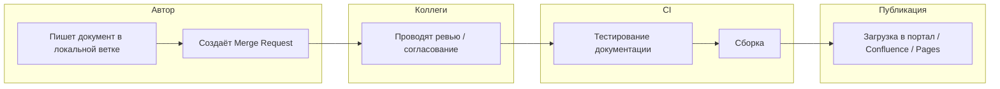

# Workflow для документации

## Автор
Автор пишет документацию в локальной ветке репозитория, используя язык разметки

## Коллеги

Автор создаёт Pull/Merge Request. Коллеги проверяют структуру, содержание, терминологию и техническую точность текста.

## CI

Запускаются автоматические проверки качества документации и тестирование, а также могут выполняться ручные тесты для оценки содержания и корректности

Линтеры и тестирование:

- `markdownlint` — проверка синтаксиса и форматирования Markdown
- `vale` — проверка стиля и терминологии (на соответствие глоссарию и корпоративному стилю)
- `codespell` — автоматический поиск опечаток
- `yamllint` — проверка YAML-конфигураций (если используются)
- `markdown-link-check` — проверка валидности и доступности ссылок в документах
- `unit-тесты`
- Проверка целостности и полноты документации

## Публикация

Финальный артефакт (HTML, PDF, DOCX или сайт) автоматически публикуется на целевые платформы:

- Внутренние порталы
- Confluence (синхронизация)
- GitHub Pages / GitLab Pages

Что автоматизируется:
- Выгрузка файлов
- Конвертация форматов
- Отправка уведомлений