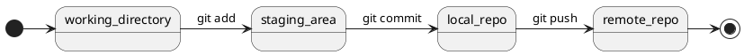

# Как все устроено

- Распределенная система.
- Локальные операции.
- Снимки файловой системы.

## Основной flow

**Рабочая директория (Working Directory)** - это папка на локальной машине, где находятся все файлы проекта в текущем состоянии: те, что были созданы, изменены или удалены.

**Индекс (Staging Area)** - промежуточная область, в которую попадают именно те изменения, которые нужно зафиксировать в следующем коммите.

Зачем нужен индекс:

- Позволяет точно контролировать, какие изменения попадут в следующий коммит.
- Можно подготовить коммит из части файлов или даже части изменений в одном файле.
- Позволяет разделять логически несвязанные изменения на отдельные коммиты.

**Коммит (commit)** - зафиксированное состояние проекта на определённый момент времени.

Всё, что в индексе на момент вызова команды, сохраняется как «снимок» всех отслеживаемых файлов в репозитории и сохраняет изменения, внесённые с момента последнего коммита, с уникальным идентификатором (SHA-1) и вашим сообщением.
Индекс при этом очищается (становится пустым), а рабочая директория остаётся в состоянии «ниже по состоянию», если там были изменения, которые не были добавлены.

## Работа с ветками

**Ветка** - отдельная линия разработки.

**Технически:** ветка - это переменная (указатель) в Git, указывающая на конкретный коммит. При создании новой ветки, создается новый указатель. Когда разработчик делает коммиты в этой ветке, указатель смещается вперёд по цепочке коммитов.

**HEAD** - указатель на текущую активную ветку или конкретный коммит, с которым производится работа на текущий момент.

Зачем нужно ветвление:

- Безопасность: по умолчанию есть главная ветка (main или master), разработка новых функций и экспериментов ведется в отдельных ветках.
- Понятность: по названию ветки сразу видно, над чем велась работа - принято называть ветки по номеру задачи в JIRA.
- Гибкость: при необходимости легко вернуть изменения, просто не вливая ветку.

**Конфликт** - ситуация, когда Git не может автоматически объединить изменения из разных веток, потому что они затрагивают одни и те же строки в одних и тех же файлах.

Когда возникает конфликт:

- При слиянии (merge) двух веток, если обе изменяли одну и ту же часть файла.
- При ребейзе (rebase), когда изменения "переписываются" поверх других.
- При стягивании изменений (pull), если локальные изменения противоречат удалённым.

